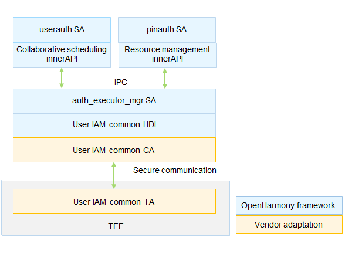

# Authentication Executor Management (auth_executor_mgr)


## Introduction

As a basic component of the User Identity & Access Management (IAM) subsystem, Authentication Executor Management (auth_executor_mgr) manages and schedules authentication resources in the system. Currently, password authentication and facial authentication are supported.

The user authentication unit on the device is called authentication executor.

The auth_executor_mgr module provides a set of resource management APIs. After implementing these APIs, the authentication executor can connect to auth_executor_mgr to provide authentication capabilities for the system.

**Figure 1** auth_executor_mgr architecture




The OpenHarmony framework implements the auth_executor_mgr service and has encapsulated the collaborative scheduling and resource management APIs. Device vendors need to adapt some functions of the auth_executor_mgr component to meet higher security requirements. The APIs that need to be adapted by device vendors are defined in the IAM common HDI.

## Directory Structure

```undefined
//base/user_iam/auth_executor_mgr
├── common					# Directory for storing the IAM common HDI
├── frameworks				# Framework code
├── interfaces				# Directory for storing external interfaces
│   └── innerkits			# Header files exposed to the internal subsystem
├── sa_profile				# Profile of the Service ability
├── services				# Implementation of the Service ability
├── test					# Directory for storing test code
├── utils					# Directory for storing utility code
├── auth_executor_mgr.gni	# Build configuration
└── bundle.json				# Component description file
```


## Usage

### Available APIs

**Table 1** APIs for managing authentication resources

| API | Description                            |
| ------ | -------------------------------- |
| uint64_t Register(std::shared_ptr<AuthExecutor> executorInfo, std::shared_ptr<ExecutorCallback> callback); | Registers an authentication executor to transfer basic authentication information.|
| void QueryStatus(AuthExecutor &executorInfo, std::shared_ptr<QueryCallback> callback); | Obtains the authentication executor status (whether the authentication executor has been registered).|

**Table 2** APIs for executing authentication

| API| Description                      |
| ------ | -------------------------------- |
| virtual void OnMessengerReady(const sptr&lt;IExecutorMessenger&gt; &amp;messenger); | Notifies the authentication executor that the messenger is available and transfers the messenger for subsequent communication with the executor.|
| virtual int32_t OnBeginExecute(uint64_t scheduleId, std::vector<uint8_t> &publicKey, std::shared_ptr<AuthAttributes> commandAttrs); | Instructs the authentication executor to perform authentication-related operations. The operation attributes are passed in by **commandAttrs**.|
| virtual int32_t OnEndExecute(uint64_t scheduleId, std::shared_ptr<AuthAttributes> consumerAttr); | Instructs the authentication executor to complete this operation.|
| virtual int32_t OnSetProperty(std::shared_ptr<AuthAttributes> properties); | Sets property information.|
| virtual int32_t OnGetProperty(std::shared_ptr<AuthAttributes> conditions, std::shared_ptr<AuthAttributes> values); | Obtains property information.|

**Table 3** APIs for managing the messenger

| API                                                      | Description                                                        |
| ------------------------------------------------------------ | ------------------------------------------------------------ |
| virtual int32_t SendData(uint64_t scheduleId, uint64_t transNum, int32_t srcType, int32_t dstType, std::shared_ptr&lt;AuthMessage&gt; msg) override; | Sends a message from the authentication executor to the auth_executor_mgr. The message content is specified by the authentication executor, for example, a message indicating dark light during facial authentication.|
| virtual int32_t Finish(uint64_t scheduleId, int32_t srcType, int32_t resultCode, std::shared_ptr<AuthAttributes> finalResult) override; | Sends a message from the authentication executor to the auth_executor_mgr to complete this operation. The message contains the result of the operation.|


### Usage Guidelines

- The auth_executor_mgr Service ability provides interconnection APIs for the authentication executors. The authentication executors call the related API to register with the auth_executor_mgr.
- The APIs defined in the ```common\interface\coauth_interface.h``` header file must be implemented in a TEE. The authentication executor information cannot be tampered with, and the result returned by the authentication executor must be verified in the TEE.

## Repositories Involved

**[useriam_auth_executor_mgr](https://gitee.com/openharmony-sig/useriam_coauth)**

[useriam_user_idm](https://gitee.com/openharmony-sig/useriam_useridm)

[useriam_user_auth](https://gitee.com/openharmony-sig/useriam_userauth)

[useriam_pin_auth](https://gitee.com/openharmony-sig/useriam_pinauth)

[useriam_faceauth](https://gitee.com/openharmony/useriam_faceauth)
