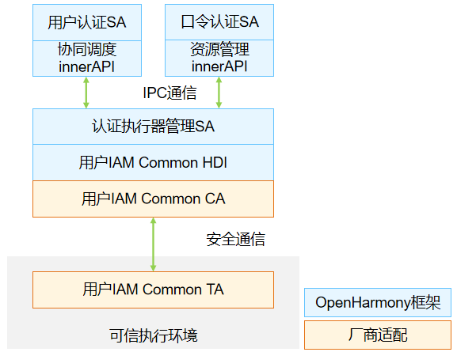

# 认证执行器管理

- [简介](#简介)
- [目录](#目录)
- [说明](#说明)
  - [接口说明](#接口说明)
  - [使用说明](#使用说明)
- [相关仓](#相关仓)


## 简介

**认证执行器管理**（auth_executor_mgr）是用户IAM子系统的基础部件之一，提供系统内认证相关资源的统一管理和协同调度能力，当前支持口令认证和人脸认证的对接。

我们将设备上的一个用户身份认证单元，称为**认证执行器**。

认证执行器管理定义了一套**资源管理**接口，新增的认证执行器在实现了认证资源管理定义的接口后，可以对接到认证执行器管理模块，从而为系统提供相关身份认证能力。

**图1** 认证执行器管理架构图




如图所示，OpenHarmony框架已经实现了认证执行器管理系统服务，并对上封装了协同调度和资源管理的接口，认证执行器管理部件内部分功能需要厂商适配来达到更高的安全性要求。需要南向厂商适配的接口，在用户IAM Common HDI中有定义。

## 目录

```undefined
//base/user_iam/auth_executor_mgr
├── common					# 用户IAM子系统commonHDI存放目录
├── frameworks				# 框架代码
├── interfaces				# 对外接口存放目录
│   └── innerkits			# 对内部子系统暴露的头文件，供系统服务使用
├── sa_profile				# Service Ability 配置文件
├── services				# Service Ability 服务实现
├── test					# 测试代码存入目录
├── utils					# 工具代码存放目录
├── auth_executor_mgr.gni	# 构建配置
└── bundle.json				# 组件描述文件
```


## 说明

### 接口说明

**表1** 资源管理接口

| 接口名  | 描述                             |
| ------ | -------------------------------- |
| uint64_t Register(std::shared_ptr<AuthExecutor> executorInfo, std::shared_ptr<ExecutorCallback> callback); | 注册接口，执行器传入基本信息和实现的回调函数 |
| void QueryStatus(AuthExecutor &executorInfo, std::shared_ptr<QueryCallback> callback); | 状态查询接口，查询当前执行器是否已经注册 |

**表2** 执行器需要实现的回调接口

| 接口名 | 描述                       |
| ------ | -------------------------------- |
| virtual void OnMessengerReady(const sptr&lt;IExecutorMessenger&gt; &amp;messenger); | 通知执行器信使可用，传入信使（用于后续与执行器通信） |
| virtual int32_t OnBeginExecute(uint64_t scheduleId, std::vector<uint8_t> &publicKey, std::shared_ptr<AuthAttributes> commandAttrs); | 通知执行器开始执行认证相关操作，commandAttrs中传入本次操作的属性 |
| virtual int32_t OnEndExecute(uint64_t scheduleId, std::shared_ptr<AuthAttributes> consumerAttr); | 通知执行器结束本次操作 |
| virtual int32_t OnSetProperty(std::shared_ptr<AuthAttributes> properties); | 设置属性信息 |
| virtual int32_t OnGetProperty(std::shared_ptr<AuthAttributes> conditions, std::shared_ptr<AuthAttributes> values); | 获取属性信息 |

**表3** 信使函数

| 接口名                                                       | 描述                                                         |
| ------------------------------------------------------------ | ------------------------------------------------------------ |
| virtual int32_t SendData(uint64_t scheduleId, uint64_t transNum, int32_t srcType, int32_t dstType, std::shared_ptr&lt;AuthMessage&gt; msg) override; | 发送消息，消息源为执行器，目的端为认证执行器管理，消息内容由执行器指定，比如返回人脸认证过程中的提示信息（光线过暗） |
| virtual int32_t Finish(uint64_t scheduleId, int32_t srcType, int32_t resultCode, std::shared_ptr<AuthAttributes> finalResult) override; | 操作结束，消息源为执行器，目的端为认证执行器管理，消息内容为本次操作的最终结果 |


### 使用说明

- 认证执行器管理SA提供执行器对接接口，各身份认证执行器调用资源管理接口完成认证执行器的注册。
- 需在可信执行环境内实现头文件```common\interface\coauth_interface.h``` 中定义的接口，保证认证执行器信息不可篡改，并在可信执行环境内校验认证执行器返回的结果。

## 相关仓

**[useriam_auth_executor_mgr](https://gitee.com/openharmony/useriam_auth_executor_mgr)**

[useriam_user_idm](https://gitee.com/openharmony/useriam_user_idm)

[useriam_user_auth](https://gitee.com/openharmony/useriam_user_auth)

[useriam_pin_auth](https://gitee.com/openharmony/useriam_pin_auth)

[useriam_faceauth](https://gitee.com/openharmony/useriam_faceauth)